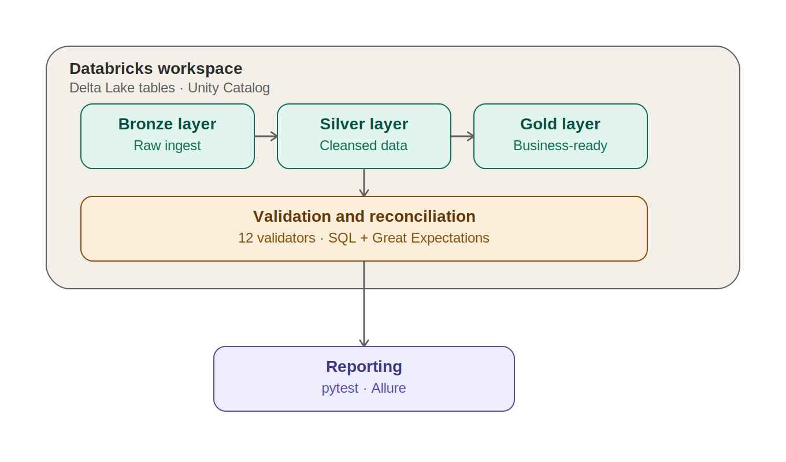
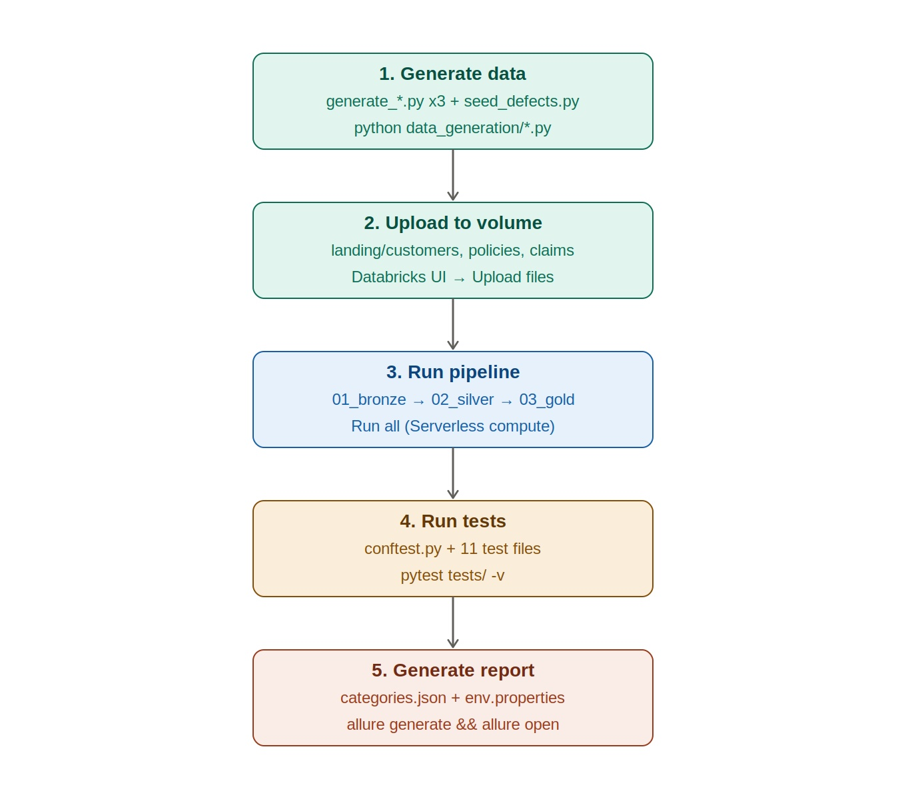

# ETL Automation: Databricks + PySpark + Great Expectations

A config-driven data quality validation framework for insurance ETL pipelines, built on Databricks, PySpark, and a dual-tool validation layer (custom SQL validators + Great Expectations), orchestrated with pytest and reported through Allure.



## What this is

A simulated insurance data pipeline (Customers, Policies, Claims) running through a full Bronze-Silver-Gold medallion architecture on Databricks Unity Catalog, with 200 deliberately seeded data quality defects caught by 12 independent validators. The core design principle: adding a new table means adding one YAML config file — zero new code, zero new test files.

**Key numbers:**
- 43 automated tests · 33 passing · 10 correctly failing on real, documented data issues
- 200/200 seeded defects caught with exact precision, cross-verified by two independent tools
- $111,992,671.79 in claim totals reconciled to the cent, Silver through Gold
- 3 tables · 3 medallion layers · 12 validators · 2 validation tools

## Execution flow



1. **Generate data** (local) — `python data_generation/generate_customers.py`, then `generate_policies.py`, `generate_claims.py`, `seed_defects.py`, in that order (each depends on the previous script's output for valid foreign keys)
2. **Upload to volume** (manual) — landing CSVs go to `/Volumes/insurance_dq_qa/bronze/landing_zone/{customers,policies,claims}/`
3. **Run pipeline** (Databricks, Serverless compute) — `01_bronze_ingest.py` → `02_silver_transform.py` → `03_gold_aggregate.py`
4. **Run tests** (local) — `pytest tests/ -v`, or filter by tier: `pytest tests/ -v -m smoke`, `-m regression`, `-m e2e`
5. **Generate report** (local) — `allure generate reports/allure-results -o reports/allure-report --clean && allure open reports/allure-report`

## Architecture

- **Bronze**: raw, unfiltered ingestion — every column read as a string, schema drift logged not dropped
- **Silver**: type casting, referential integrity, deduplication, SCD1/SCD2 branching per table config; rejected rows quarantined to `silver.rejects` with full audit detail
- **Gold**: three reconciliation-friendly aggregates (`customer_360`, `claims_summary_by_policy`, `monthly_claims_trend`), verified to match Silver exactly

## Validators

| Validator | Checks |
|---|---|
| Schema | Column presence, count, type conformance |
| Completeness | NULLs in mandatory columns |
| Business rules | Min/max, enums, date logic, cross-column comparisons |
| Uniqueness | Primary key duplication (SCD2-aware) |
| Referential integrity | Foreign key existence across tables |
| Date consistency | Cross-table temporal logic |
| SCD validation | Version and date-range integrity |
| Reconciliation | Gold vs. Silver aggregate agreement |
| File format | Landing CSV header conformance |
| Transformation | SCD1 "latest value wins" correctness |
| Great Expectations | Independent re-validation via a second tool |
| PyDeequ | Built and documented; blocked from execution by a Databricks Free Edition Serverless restriction on notebook JAR libraries — see `docs/DISCOVERED_ISSUES.md` |

## Tech stack

Databricks (Serverless) · PySpark 3.5 · Delta Lake · Unity Catalog · Great Expectations 1.19 · pytest 9.1 · Allure 2.x · `databricks-sql-connector` · Faker · PyYAML

## Project structure

```
config/tables/*.yaml       table-level rules (primary key, FKs, SCD type, business rules)
config/gold_mappings.yaml  Gold aggregation definitions
data_generation/           synthetic data generators + defect seeding
landing/                   generated CSVs (local staging before upload)
pipeline/                  Databricks notebooks (Bronze, Silver, Gold, Deequ)
framework/                 config loader, DB connection, 12 validators
tests/                     pytest suite (smoke, regression, e2e markers)
reports/                   Allure config and generated output
docs/                      DEFECTS.md, DISCOVERED_ISSUES.md, CONFIG_SCHEMA.md
```

## Notable engineering decisions

- **Config-driven, not table-specific**: every validator is a pure function taking a table's config object — no hardcoded table names anywhere in the framework layer
- **Honest test failures**: 10 of 43 tests correctly fail, catching real seeded defects — the suite reports what's actually wrong with the data, not just green checkmarks
- **Platform limitations documented, not hidden**: PyDeequ and Databricks Connect were both confirmed unsupported on Databricks Free Edition Serverless compute through official documentation; the validator layer pivoted to SQL rather than forcing a workaround — see `docs/DISCOVERED_ISSUES.md`
- **Discovered, not just seeded, issues**: the date consistency validator caught 2,856 claims with implausible date sequencing that was never deliberately planted — investigated, root-caused, and documented rather than silently regenerated away

## Links

- [Full case study](./ETL_Automation_Case_Study.md)
- [GitHub repository](https://github.com/VinodAWSDevOps/pyspark-dq-validation-framework)
